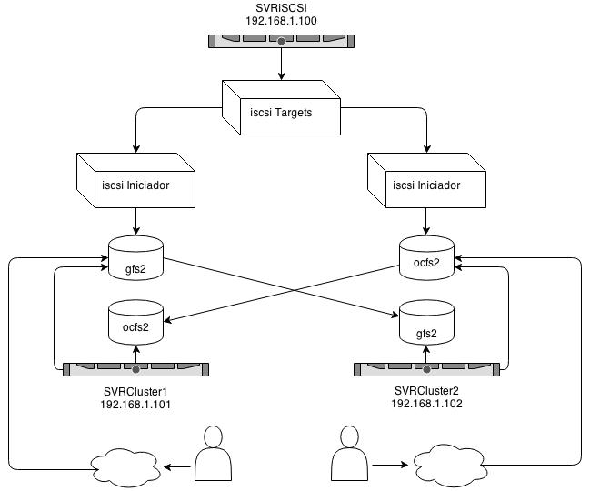

# Configuracion de cluster de HDD con gfs2(red hat) y ocfs2(oracle) + ISCSI (Ubuntu 12.04)

**iscsi**: El protocolo iSCSI es un protocolo de red de área de almacenamiento (SAN), que permite a los iniciadores iSCSI usar los dispositivos de almacenamiento de forma remota utilizando el cableado de Ethernet normal. Para el iniciador iSCSI, el almacenamiento remoto se ve como un disco duro normal, conectada localmente.

**gfs2**: Es un sistema de ficheros nativo creado por Red Hat y distribuido bajo licencia GNU, que puede ser utilizado de forma local (como por ejemplo ext3) o en cluster, de manera que varios nodos puedan estar trabajando simultáneamente sobre él sin peligro a que se corrompan los datos. La capacidad máxima de almacenamiento de GFS2 es de 8 EB.

**ocfs2**: Es un Sistema de ficheros en Cluster que permite el acceso simultáneo de multiples nodos. Deberemos definir nuestro dispositivo drbd para acceder a los nodos de la red simultaneamente. Cada nodo OCFS2 dispone de un sistema de ficheros montado, regularmente escribe un fichero meta-data permitiendo a los otros nodos saber que se encuentra disponible.

##Estructura

 



### Configuarción de servidor iSCSI
En esta sección se explica cómo se configura un iniciador iSCSI con S.O Ubuntu 12.04 y 2 clientes, ambos tambien con Ubuntu 12.04.

En la implementacion de todos los hitos de esta guia tomaremos los servidores con los siguientes nombres y las siguientes caracteristicas.

* Servidor iSCSI target (Nombre: SVRiSCSI)
	* Disco local de 14GB
	
	Sistema | 1 HDD | 2 HDD | IP
	---------- | ------------- | ------------ | ------------ 
	 		4GB  | 5GB sdb  | 5GB sdc | 192.168.1.100
* Servidor GFS2 (Nombre: SVRCluster1)
	* Disco Local 4GB
	
	Sistema | GFS2 | OCFS2 | IP
		---------- | ------------- | ------------ | ------------ 
		 		4GB  | 5GB sdb1  | 5GB sdc1 | 192.168.1.101
	
* Servidor GFS2 (Nombre: SVRCluster2)
	* Disco Local 4GB
	 
	Sistema | GFS2 | OCFS2 | IP
		---------- | ------------- | ------------ | ------------ 
		 		4GB  | 5GB sdb  | 5GB sdc | 192.168.1.102	
		

#### Configuracion de Target iSCSI
* Instalación del target de iSCSI

	`apt-get install iscsitarget`
	
* Editar **iscsitarget**

	`vim /etc/default/iscsitarget`

* Cambiar el valor **false** a **true**

	`ISCSITARGET_ENABLE=true`
	
* Editar **ietd.conf** y asignar nuestro **iqn**

	`vim /etc/iet/ietd.conf`
	
Aquí tendremos que configurar tres cosas principalmente:

* El nombre de nuestro target
* El nombre de usuario y la contraseña para la conexión del iniciador
* Los dispositivos que presentaremos como targets

El estándar iSCSI define que tanto los target como los iniciadores deben tener un nombre que sigue un patrón, el cual es el siguiente:

**iqn.[yyyy-mm].[nombre del dominio invertido]:[identificador]**

Donde:

**iqn** es un término fijo y debe figurar al principio.

**yyyy-mm** es la fecha de alta del servidor o la fecha de publicacion de los targets

A continuación debe figurar el **nombre del dominio invertido** un jemplo podria ser:

	cl.me.mediastre

Luego de los “:”, un **identificador** que podemos ponerlo a nuestro gusto, y que puede en muchos casos brindar información del target.

Un ejemplo válido sería:

	iqn.2005-02.cl.me.mediastre:san.5G.gfs2

Como vemos el identificador aunque es variable y personalizable, puede reflejar el nombre dado al target, la capacidad y el servicio donde lo usaremos.

Si queremos que nuestro target requiera autenticación., podemos definir un usuario y una contraseña para que solo se conecten los iniciadores que nosotros queremos.

debemos descomentar la linea y dejar a nuestro gusto esta información

		#IncomingUser joe secret		
	
un ejemplo valido seria: 

	 IncomingUser mediastream dsfrebt43

donde **mediastream** es el nombre de usuario y **dsfrebt43** nuestra contraseña

Como ultimo paso devemos declarar los dispositivos que se presentaran para ser iniciados en los clientes, se debe descomentar y editar la linea siguiente:

	#Lun 0 Path=/dev/sdc,Type=fileio,ScsiId=xyz,ScsiSN=xyz
	
como nuestro sistema presentara dos discos los declararemos de la siguiente manera:

	Lun 0 Path=/dev/sdb,Type=fileio
	Lun 1 Path=/dev/sdc,Type=fileio
	
En este ejemplo el primer dispositivo que estamos ofreciendo es la partición /dev/sdb  del servidor y el segundo en /dev/sdc. La documentación nos dice que además de particiones podemos usar discos enteros, volúmenes LVM y RAID, e incluso archivos. En cualquier caso solo hay que definir el path.

Una vez que hemos configurado el servidor y que tenemos listos nuestros discos a ofrecer, debemos levantar el servidor.

`/etc/init.d/iscsitarget restart`

Por último si queremos que nuestro servicio iSCSI target inicie junto con el servidor, debemos agregarlo al inicio del sistema.

`update-rc.d iscsitarget defaults`

#### Configuración de nuestro iniciador

Lo primero que vamos a hacer es instalar el software iniciador. usaremos open-iscsi, además está dentro de la paquetería de Debian y ubuntu. Lo instalamos de la siguiente manera en los server clientes **SVRCluster1** y **SVRCluster2**

`apt-get install open-iscsi`

una vez instalado debemos editar el archivo de iniciacion de **open-iscsi** y cambiar   

`vim /etc/iscsi/iscsid.conf`

	node.startup = manual 

y debe quedar 

	node.startup = automatic	

reiniciar el iniciador

`/etc/init.d/open-iscsi restart`

#####Configuración de open-iscsi

La configuración de open-iscsi se realiza a través del comando **iscsiadm** y la misma se guarda en una base de datos. Si queremos cambiar algún parámetro de la configuración tenemos que hacerlo a través de iscsiadm.

######Detección del target

En primer lugar tenemos que indicarle a iscsiadm que detecte nuestro target iSCSI y lo agregue a su base de datos. Hay que aclarar que iscsiadm tiene tres formas de operación

**discovery:** En este modo se pueden descubrir targets y agregarlos a la base de datos.

**node:** En este modo se administran los targets ya descubiertos y se pueden visualizar datos acerca de estos nodos, así como conectarse a ellos.

**session:** En este modo se administran los targets a los que se está conectados (en los que se ha hecho login).


Para descubrir nuestro target usamos obviamente **discovery**, se debe ejecutar:

`iscsiadm -m discovery -t st -p 192.168.1.100`

Este comando nos entregara el siguiente resultado que es el iqn que configuramos en el servidor de iSCSI 

**192.168.1.100,1 iqn.2005-02.cl.me.mediastre:san.5G.gfs2**

ahora debemos conectarnos con nuestro servidor **iSCSI** mediante el inicador de **open-iscsi**

```
iscsiadm -m node --targetname 192.168.1.100,1 iqn.2005-02.cl.me.mediastre:san.5G.gfs2 -p 192.168.1.100 -o update -n node.session.auth.username -v mediastream -n node.session.auth.password -v dsfrebt43 --login
```

con esto ya deberiamos tener conectadas las dos unidades presentadas desde nuestro servidor **iSCSI**, para comprobarlo basta hacer un **dmesg** del sistema y veremos lo que conecto

`dmesg`

	SCSI device sdb: 390620475 512-byte hdwr sectors (199998 MB)
	sdb: Write Protect is off
	sdb: Mode Sense: 77 00 00 08
	SCSI device sdb: drive cache: write through
	SCSI device sdb: 390620475 512-byte hdwr sectors (199998 MB)
	sdb: Write Protect is off
	sdb: Mode Sense: 77 00 00 08
	SCSI device sdb: drive cache: write through
	sdb: sdb
	sd 1:0:0:0: Attached scsi disk sdb
	SCSI device sdc: 390620475 512-byte hdwr sectors (199998 MB)
	sdc: Write Protect is off
	sdc: Mode Sense: 77 00 00 08
	SCSI device sdc: drive cache: write through
	SCSI device sdc: 390620475 512-byte hdwr sectors (199998 MB)
	sdc: Write Protect is off
	sdc: Mode Sense: 77 00 00 08
	SCSI device sdc: drive cache: write through
	sdc: sdc
	sd 1:0:0:0: Attached scsi disk sdc

### Creacion de particiones, formateos y armados del cluster
#### gfs2

Instalar los siguientes paquetes en los servidores clientes

`apt-get install pacemaker cman resource-agents fence-agents gfs2-utils gfs2-cluster ocfs2-tools-cman openais rgmanager`

configurar el archivo **hosts** en los tres servidores

`vim /etc/hosts`

deberia quedar de la siguiente forma

	127.0.0.1       localhost
	192.168.1.100   SVRiSCSI
	192.168.1.101	SVRCluster1
	192.168.1.102	SVRCluster2

	# The following lines are desirable for IPv6 capable hosts
	::1     ip6-localhost ip6-loopback
	fe00::0 ip6-localnet
	ff00::0 ip6-mcastprefix
	ff02::1 ip6-allnodes
	ff02::2 ip6-allrouters

Desabilitar **o2cb** del inicio 

`update-rc.d -f o2cb remove`

Trabajaremos con el sistema de archivos **gfs2** en el servidor **SVRCluster1** y con **ocfs2** en **SVRCluster2** 


	Servidor | IP | HDD | FileSystem
	---------- | ------------- | ------------ | ------------ 
	 		SVRCluster1 | 192.168.1.101 | sdb | GFS2
	 		SVRCluster2 | 192.168.1.102 | sdc | OCFS2

######Creacion de particion sdb en SVRCluster1

`fdisk /dev/sdb`

* presione **n** para la creacion de una nueva particion
* presione **w** para la escritura de la nueva particion

una vez terminada la creacion ya podremos formatear nuestra unidad con un sistema de archivos gfs2 

`mkfs.gfs2 -p lock_dlm -t clusterme:gfs2 -j 2 /dev/sdb1` 

* donde:

	* **mkfs.gfs2:** Tipo de formato que en este caso sera el nuevo sistema de archivos en cluster de RedHat
	* **p lock_dlm:** El parámetro lock_dlm indica el protocolo de bloqueo a emplear, siendo lock_dlm (DLM - Distributed Lock Manager) para el caso de acceso concurrente y lock_nolock para el caso de acceso de un único nodo.
	* **-t clusterme:gfs2:** Con la opción de -t se especifica el nombre del cluster y el nombre que le queremos dar al sistema de archivos
	* **-j 2:** indica el número de nodos que accederán concurrentemente al sistema de archivos
	* **/dev/sdb1:** Unidad a formatear
	
###### Creacion de archivo de cluster para gfs2

Cree el archivo **cluster** en ambos servidores clientes y Pegue la siguiente informacion en `/etc/cluster/cluster.conf`


	<?xml version="1.0"?>
    	    <cluster name="clusterme" config_version="3">
        	<cman two_node="1" expected_votes="1"/>
        	<gfs_controld enable_plock="1"/>

	<clusternodes>
    	    <clusternode name="SVRCluster1" votes="1" nodeid="1">
        	        <fence>
            	            <method name="single">
                	                <device name="manual" ipaddr="192.168.1.101"/>
                   		    </method>
                	</fence>
        	</clusternode>
        	<clusternode name="SVRCluster2" votes="1" nodeid="2">
            	    <fence>
                	        <method name="single">
                   	             <device name="manual" ipaddr="192.168.1.102"/>
                   		    </method>
                	</fence>
        	</clusternode>
	</clusternodes>
		<fence_daemon clean_start="1" post_fail_delay="0" post_join_delay="3"/>
					<fencedevices>
        			<fencedevice name="manual" agent="fence_manual"/>
		</fencedevices>
	</cluster>

**Lineas Importantes:**

	<cluster name="clusterme" config_version="3">

Esta linea indica el nombre del cluster, el cual definimos al momento de formatear la unidad sdb1

	<clusternode name="SVRCluster1" votes="1" nodeid="1">

Linea que hace la llamada al primer nodo y le da como identificador de **nodeid=1**, en el caso de ser el nodo 2 cambia la informacion a la que tiene el servidor 2

	<device name="manual" ipaddr="192.168.1.101"/>
	
Linea que indica la ip del servidor 

NOTA: el resto de las lineas no se tocan.

###### Montaje de sdb1 como sistema de archivos gfs2

El montaje lo realizaremos en el cliente1 **SVRCluster1**, crearemos nuestro punto de montage en **/mnt/**

`mkdir /mnt/gfs2`

Procedemos a montar la particion en **/mnt/gfs2**

`mount -t gfs2 /dev/sdb1 /mnt/gfs2`

Realizamos el mismo procedimiento en el servidor cliente2 **SVRCluster2**

Por último, sólo tendremos que reiniciar los servicios gfs2, cman, rgmanager y en ambos servidores, partiendo por SVRCluster1 y mediante el comando chkconfig haremos que dichos demonios se inicien automáticamente cada vez que arranque el nodo.

`/etc/init.d/gfs2-cluster restart`

`/etc/init.d/cman restart`

`/etc/init.d/rgmanager restart`

`update-rc.d gfs2 default`

`update-rc.d cman default`

`update-rc.d rgmanager default`

Si ejecutamos el comando clustat, podremos ver la configuración actual del cluster que acabamos de levantar.


	Cluster Status for cluster1 @ Fri Feb  7 15:10:11 2014
	Member Status: Quorate
	
	 Member Name                             ID   Status
	 ------ ----                             ---- ------
 	SVRCluster1                                 1 Online, Local
 	SVRCluster2                                 2 Online

#### ocfs2

Ya tenemos instalados los paquetes necesarios en nuestro servidor segun los pasos anteriores por lo que comenzaremos inmediatamente con la configuracion. 

Trabajaremos con el sistema de archivos **ocfs2** en el servidor **SVRCluster2**

	
	Servidor | IP | HDD | FileSystem
	---------- | ------------- | ------------ | ------------ 
	 		SVRCluster1 | 192.168.1.101 | sdb | GFS2
	 		SVRCluster2 | 192.168.1.102 | sdc | OCFS2	
	
######Creacion de particion sdb en SVRCluster2

`fdisk /dev/sdc`

* presione **n** para la creacion de una nueva particion
* presione **w** para la escritura de la nueva particion

una vez terminada la creacion ya podremos formatear nuestra unidad con un sistema de archivos ocfs2 

`mkfs.ocf2 /dev/sdc1` 

* donde:

	* **mkfs.ocfs2:** Tipo de formato que en este caso sera el nuevo sistema de archivos en cluster de Oracle
	* **/dev/sdc1:** Unidad a formatear
	
###### Creacion de archivo de cluster para ocfs2

Cree el archivo **cluster** en ambos servidores clientes y Pegue la siguiente informacion en `/etc/ocfs2/cluster.conf`

	
	node:
    	    ip_port = 7777
        	ip_address = 192.168.1.101
        	number = 0
        	name = SVRCluster1
        	cluster = clusterme2
	node:
    	    ip_port = 7777
        	ip_address = 192.168.1.102
        	number = 1
        	name = SVRCluster1
        	cluster = clusterme2
	cluster:
    	    node_count = 2
        	name = clusterme2
        	
habilitar el cluster

`dpkg-reconfigure ocfs2-tools`


		──────────────────┤ Configuring ocfs2-tools ├───────────────────┐
       │                                                                │
       │                                                                │
       │                                                                │
       │ Would you like to start an OCFS2 cluster (O2CB) at boot time?  │
       │                                                                │
       │                 <Yes>                    <No>                  │
       │                                                                │
       └────────────────────────────────────────────────────────────────┘
       
seleccionames **yes**


				┌─────────┤ Configuring ocfs2-tools ├─────────┐
                │                                             │
                │                                             │
                │ Name of the cluster to start at boot time:  │
                │                                             │
                │ clusterme2_________________________________ │
                │                                             │
                │                   <Ok>                      │
                │                                             │
                └─────────────────────────────────────────────┘
                
Ingresamos el nombre de nuestro cluster **clusterme2** y precionamos **OK** al resto de las opciones le dan **OK** y ya nuestro cluster esta inicado

Iniciar servicios y dejarlos al inicio 

`/etc/init.d/o2cb restart`

`update-rc.d cman o2cb`

revisar estado 

`/etc/init.d/o2cb status`

	Driver for "configfs": Loaded
	Filesystem "configfs": Mounted
	Stack glue driver: Loaded
	Stack plugin "o2cb": Loaded
	Driver for "ocfs2_dlmfs": Loaded
	Filesystem "ocfs2_dlmfs": Mounted
	Checking O2CB cluster clusterme2: Online
	Heartbeat dead threshold = 31
 	Network idle timeout: 30000
  	Network keepalive delay: 2000
  	Network reconnect delay: 2000
	Checking O2CB heartbeat: Active

###### Montaje de sdc1 como sistema de archivos ocfs2

El montaje lo realizaremos en el cliente2 **SVRCluster2**, crearemos nuestro punto de montage en **/mnt/**

`mkdir /mnt/ocfs2`

Procedemos a montar la particion en **/mnt/ocfs2**

`mount -t ocfs2 /deb/sdb1 /mnt/ocfs2`

Realizamos el mismo procedimiento en el servidor cliente1 **SVRCluster1**

#### Links and Email

- Using iSCSI On Ubuntu 10.04 <http://www.howtoforge.com/using-iscsi-on-ubuntu-10.04-initiator-and-target>
- Setup GFS2 Cluster Ubuntu <http://databom.blogspot.com/2010/10/setup-gfs2-cluster-ubuntu.html>
- Instalando un target iSCSI <http://federicosayd.wordpress.com/2007/09/11/instalando-un-target-iscsi/>
- Montando un iniciador iSCSI en Linux <http://federicosayd.wordpress.com/2007/09/13/montando-un-iniciador-iscsi-en-linux/>
- Almacenamiento compartido en red: GFS2 + iSCSI <http://redes-privadas-virtuales.blogspot.com/2009/08/almacenamiento-compartido-en-red-gfs2_17.html>
- Pacemaker + cman for GFS2 and OCFS2<https://wiki.ubuntu.com/ClusterStack/Precise>
- OCFS2 cluster <http://linux.cloudibee.com/2013/01/ocfs2-cluster-quick-setup-guide/>
- Set up an OCFS2 cluster filesystem <http://linux.dell.com/wiki/index.php/Set_up_an_OCFS2_cluster_filesystem>
